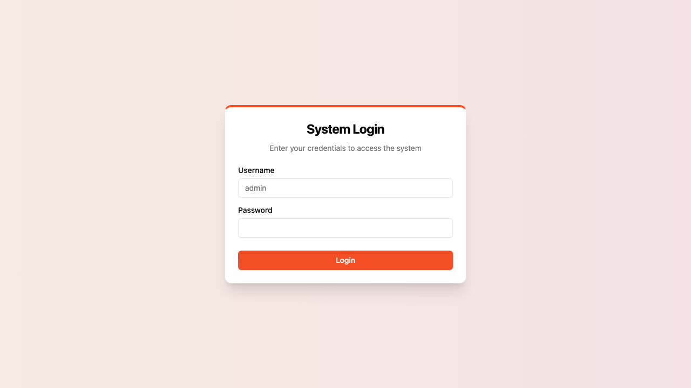
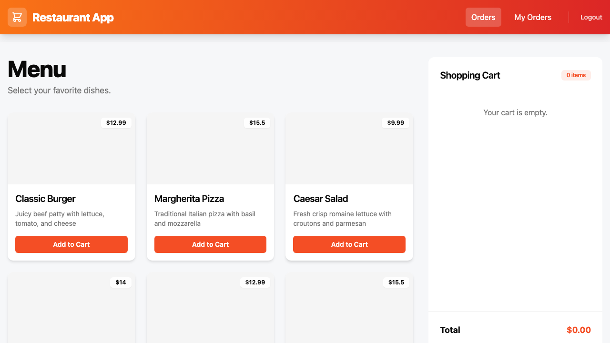
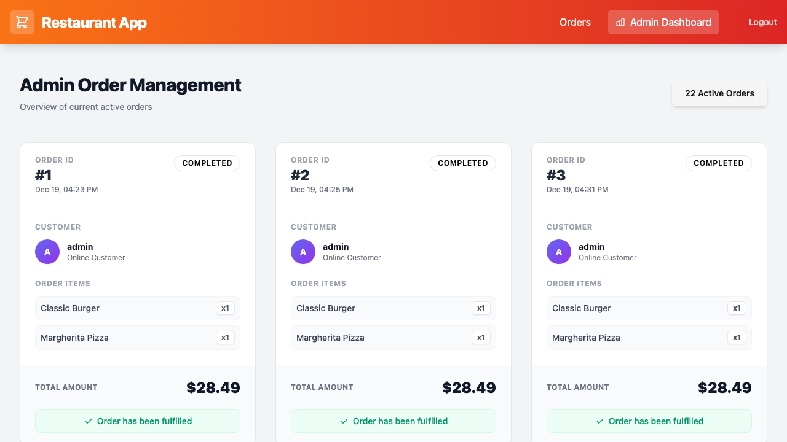
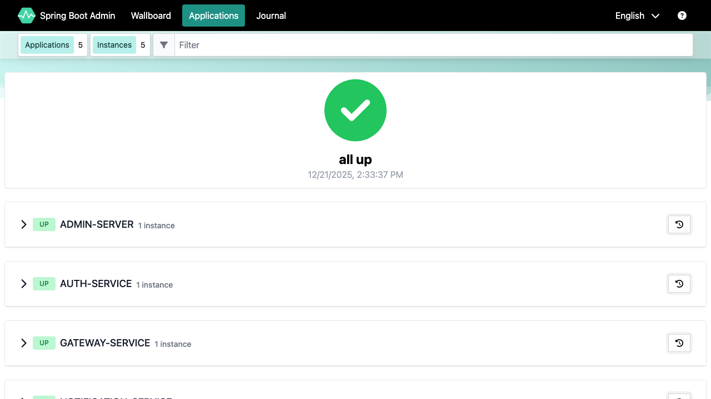

# Mini Restaurant App (Commercial Edition)

> **Status**: Production-Ready / Stable
> **Version**: 2.0

A **scalable, cloud-native e-commerce platform** architected for real-world commercial operation. Moving beyond a simple MVP, this system serves as a reference implementation for:
-   **Microservices**: Spring Cloud, Eureka, Gateway, OpenFeign.
-   **Micro-Frontends**: Vue 3 + Module Federation (Host & Remote Apps).
-   **Global Operations**: Multi-timezone support & i18n architectural readiness.

> **📖 Source of Truth**: For detailed architecture, API specs, and technical decisions, please refer to [SYSTEM_DESIGN.md](./SYSTEM_DESIGN.md).

---

## 1. System Overview

Welcome to the Mini Restaurant App! This platform demonstrates a robust, modern microservices architecture tailored for scalable e-commerce scenarios. It features a dual-interface design catering to both customers and administrators, powered by a resilient backend ecosystem.

### 🌟 User-Facing Features

#### 🛍️ Client Application (Customer View)
- **Interactive Menu**: Browse menu items with **Category Filters** (Main, Starter) and **Search** capability. Real-time availability.
- **Smart Cart**: Add items to your cart, view totals, and manage quantities effortlessly.
- **Secure Checkout**: Seamless order placement process with instant feedback.
- **Order History**: Track your past orders and their processing status (Pending, preparing, etc.).

> 
> *Secure Login Page*

> 
> *Interactive Menu with Cart integration*

#### 🛡️ Admin Dashboard (Management View)
- **RBAC Security**: Role-Based Access Control ensuring only authorized personnel access sensitive data.
- **Menu Management**: Interface to create, update, and delete menu items (CRUD).
- **Order Monitoring**: Real-time view of incoming orders with **Status Tabs** (Pending, Kitchen, Counter) to streamline operations.

> 
> *Admin Dashboard for order management*

#### 📊 Backend Monitoring (DevOps View)
- **Centralized Dashboard**: A powerful **Spring Boot Admin** interface to monitor the health of all microservices.
- **Real-Time Metrics**: Track CPU usage, Memory (Heap/Non-Heap), Thread states, and HTTP request throughput.
- **Service Discovery**: Visual confirmation of all active services (Auth, Order, Gateway, Notification) via Eureka.

> 
> *Live System Monitoring*

---

## 2. Project Structure

- **`infrastructure/`**: Envoy proxy config and DB init scripts.
- **`backend-services/`**: Maven multi-module monorepo.
    - `registry-server`: Eureka Discovery (8761)
    - `admin-server`: **[NEW]** Spring Boot Admin Dashboard (9090)
    - `gateway-service`: Spring Cloud Gateway (8080 internal)
    - `auth-service`: Authentication & JWT (RSA + BCrypt)
    - `order-service`: Order management & RabbitMQ producer
    - `notification-service`: Async notification consumer
- **`frontend/`**:
    - `host-app`: Main Shell (Vite + Vue 3)
    - `sub-app-menu`: Menu & Cart Remote (Mounted at `/`)
    - `sub-app-admin`: Admin Dashboard Remote (Mounted at `/admin`)

## 3. Quick Start

### 3.1 Backend Infrastructure (Docker)
Start the entire backend ecosystem including databases, message queues, and monitoring:

```bash
docker-compose up --build -d
```

**Service Endpoints**:
- **Application Entry (Envoy)**: http://localhost:8080
- **Admin Monitoring Dashboard**: http://localhost:9090 (Login not required for local dev)
- **Eureka Dashboard**: http://localhost:8761
- **MySQL**: Port 3307 (`root`/`root`)

> **Note**: On the first `docker-compose up`, the `auth-service` automatically seeds the database with initial users (`admin`, `customer`) via `import.sql`.
> **Persistence**: A Docker Named Volume (`mysql_data`) is configured to persist database changes across restarts.
> ⚠️ **Warning**: Running `docker-compose down -v` will **DELETE** this volume and ALL database data. Use `docker-compose down` (without `-v`) to stop services while keeping data.

### 3.2 Frontend (Development)
The frontend uses **Vite Plugin Federation**. You need to run the host and all sub-apps simultaneously for full functionality.

```bash
# Terminal 1: Host App
cd frontend/host-app && npm run dev

# Terminal 2: Menu Sub-app
cd frontend/sub-app-menu && npm run preview

# Terminal 3: Admin Sub-app
cd frontend/sub-app-admin && npm run preview
```
> **CRITICAL**: Sub-apps (Menu, Admin) **MUST** be run in `preview` mode (after `npm run build`). Running them in `dev` mode will fail to generate/serve `remoteEntry.js`, preventing the Host App from loading module federation remotes.

Access the app at: **http://localhost:3000**

## 4. User Manual (Getting Started)

Once the system is running, follow these steps to explore the features.

### 4.1 Login Credentials
The system comes with pre-seeded accounts (see `auth-service/src/main/resources/import.sql`).

| Role | Username | Password | Access |
| :--- | :--- | :--- | :--- |
| **Administrator** | `admin` | `123456` | Full access to Storefront and Admin Dashboard. |
| **Customer** | `customer` | `123456` | Access to Storefront, Cart, and Order History. |

### 4.2 Customer Journey (Storefront)
1.  **Select Mode**: Choose between **Takeout** or **Dine-in** on the welcome screen.
2.  **Browse Menu**: View available items (Dine-in mode shows Table Number).
3.  **Add to Cart**: Add items to your cart.
4.  **Checkout**:
    -   **Takeout**: Proceed to checkout -> Redirect to Login -> **Quick Login** (Mobile Number) -> Return to Cart -> Pay Now.
    -   **Dine-in**: Select Table -> Proceed to checkout -> **Instant Order** (No Login required).
5.  **View History** (Logged-in only): Go to "My Orders" via the profile menu.
    -   **Cancel Order**: Click "Cancel Order" on `PENDING` orders.
    -   **Track**: Watch status updates (`PENDING` -> `PREPARING` -> `READY`).

### 4.3 Administrator Journey (Dashboard)
1.  **Login**: Logout and sign in with the **Administrator** credentials.
2.  **Access Admin Panel**: Click the "Order Management (Admin)" link in the Navbar (only visible to admins).
3.  **Manage Orders**:
    -   View a list of all successful orders.
    -   (Future) Update status from `PENDING` to `COMPLETED`.

#### 📋 Admin Dashboard Tabs
The dashboard organizes orders using the following logic:
- **Active**: All orders requiring attention (`PENDING`, `PAID`, `PREPARING`, `READY`).
- **Pending**: New orders awaiting acceptance (`PENDING`, `PAID`).
- **Kitchen**: Orders currently being prepared (`PREPARING`).
- **Counter**: Orders ready for pickup (`READY`).
- **History**: Finalized orders (`COMPLETED`, `CANCELLED`).

### 4.4 System Monitoring (DevOps)
-   **Dashboard**: Visit `http://localhost:9090` (Spring Boot Admin).
-   **Check Health**: Verify that `AUTH-SERVICE`, `ORDER-SERVICE`, etc., are all **UP**.
-   **View Metrics**: Click on `ORDER-SERVICE` -> **Insights** -> **Metrics** to see real-time graph data.

### 4.5 API Documentation (Developers)
-   **Unified Access**: Gateway aggregates all microservice APIs into a single portal.
-   **Interactive UI**: Use **Swagger UI** to explore endpoints and test requests directly.
-   **URL**: `http://localhost:8088/webjars/swagger-ui/index.html` (Select Service: Auth / Order)

## 5. Key Technical Highlights

- **Micro-Frontends**: Independent deployment of Menu and Admin interfaces using Module Federation.
- **Security**:
    - **End-to-End Encryption**: RSA-encrypted password transmission during login.
    - **Database-backed Authentication**: MySQL storage with BCrypt hashing for passwords.
    - **JWT & RBAC**: Stateless authentication with strictly enforced Role-Based Access Control on both Frontend (Guards) and Backend (PreAuthorize).
    - **Redis Integration**: High-performance token management and white-listing.
-   **Observability**:
    -   **Actuator & Prometheus**: Full metric exposure (`/actuator/**`) enabled on all services for deep system insights.
    -   **Visual Monitoring**: Integrated Spring Boot Admin for real-time health checks and JVM diagnostics.
    -   **API Documentation**: Integrated **SpringDoc OpenAPI** with Gateway Aggregation for centralized API exploration.
- **Resilience**: RabbitMQ for asynchronous, decoupled order processing.
- **Network**: "Defense in Depth" topology with Envoy Proxy and Spring Cloud Gateway.

## 6. Development Guidelines

### 6.1 Coding Standards (Critical)
To ensure system stability and data integrity, the following rules are **MANDATORY**:

-   **Timezone Handling**:
    -   **MUST** use `java.time.Instant` for all Entity timestamps (e.g., `createdAt`, `updatedAt`).
    -   **FORBIDDEN**: The use of `LocalDateTime` for persistence is strictly prohibited to prevent timezone offset errors.
    -   **API Standard**: All date-time fields in JSON responses must be in ISO 8601 UTC format (ends with `Z`).

Please refer to [SYSTEM_DESIGN.md](./SYSTEM_DESIGN.md) for:
- 🛠 **Technology Stack** versions
- 🔐 **Security Architecture** details
- 🧱 **Adding new Microservices/Sub-apps**
- 📡 **API Catalog**

### Security Rules (Strict)
- **Secrets**: Manage local secrets in root `.env` (git-ignored).
- **Logs**: No sensitive PII or tokens in logs.

---
*Maintained by Antigravity AI Agent*
