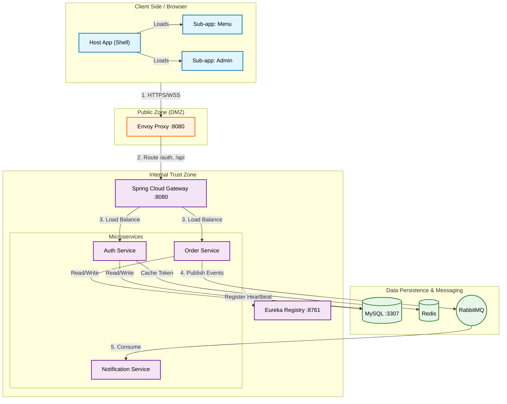
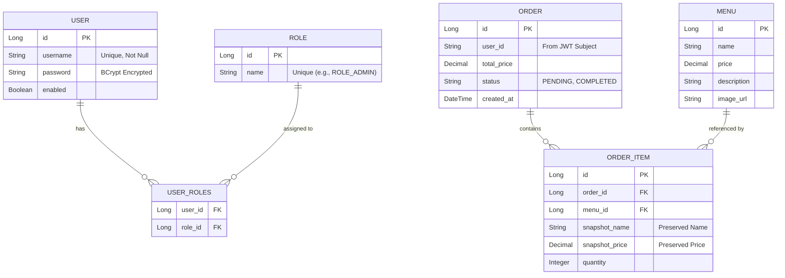

# System Design Specification: Mini Restaurant App

> **Version**: 1.1 (Released: 2025-12-21)
> **Status**: Active Development
> **Authors**: Antigravity AI Agent

---

## 1. Executive Summary

The **Mini Restaurant App** is a scalable, cloud-native e-commerce platform designed to demonstrate modern software architecture. It facilitates:
1.  **Customer Operations**: Browsing menus, managing carts, and placing orders.
2.  **Admin Operations**: Order management and Dashboard monitoring.

The system is built on a **Microservices** backend (Spring Cloud) and a **Micro-frontend** client (Vue 3 Module Federation), emphasizing separation of concerns, scalability, and security.

---

## 2. High-Level Architecture

### 2.1 Traffic Flow Topology
The network topology implements a "Defense in Depth" strategy with three distinct zones.

### 2.2 Component Roles
-   **Envoy Proxy**: Edge entry point, TLS termination (planned).
-   **Spring Cloud Gateway**: Internal routing, JWT validation interceptor, Request logging.
-   **Eureka**: Service Registry for dynamic service discovery.
-   **Microservices**: Domain-specific logic containers (Auth, Order, Notification).

---

## 3. Data Design & Schema (ERD)

The system uses **MySQL 8.0** for relational data persistence. The schema is distributed across service-specific logical databases (e.g., `auth_db`, `order_db`) but depicted here in a unified view.

### 3.1 Entity Relationship Diagram

### 3.2 Design Patterns
-   **Snapshot Pattern**: `ORDER_ITEM` stores `snapshot_name` and `snapshot_price` at the time of purchase. This prevents historical orders from changing if the `MENU` item is updated later.
-   **Loose Coupling**: `ORDER` table links to `USER` via a string `user_id` (from JWT), not a database Foreign Key. This ensures microservice independence.

---

## 4. Security Architecture

### 4.1 Authentication Pipeline (RSA + BCrypt)
A robust "Encryption in Transit" mechanism is used for login.

1.  **Public Key Fetch**: Client `GET /auth/public-key`.
2.  **Encryption**: Client encrypts password using RSA (`JSEncrypt`).
3.  **Transmission**: Encrypted payload sent to `POST /auth/login`.
4.  **Decryption**: Backend decrypts using stored Private Key.
5.  **Verification**: Decrypted password is verified against `BCrypt` hash in DB.

### 4.2 Authorization (JWT + RBAC)
-   **Token Format**: Standard JWT (HS256).
-   **Claims**: `sub` (username), `roles` (["ROLE_ADMIN", ...]), `exp`.
-   **Enforcement**:
    -   **Gateway**: Validates signature.
    -   **Service Layer**: `@PreAuthorize("hasRole('ADMIN')")` secures specific endpoints.

---

## 5. Micro-Frontends (Module Federation)

We use **Vite Plugin Federation** to compose the UI at runtime.

| App Name | Type | Mount Point | Responsibility |
| :--- | :--- | :--- | :--- |
| **Host App** | Shell | `/` | Layout, Routing, Auth State (Pinia) |
| **Menu App** | Remote | `/` | Food Menu, Shopping Cart |
| **Admin App** | Remote | `/admin` | Dashboard, Order Management |

**Constraint**: Remote apps must be built and served in `preview` mode (`npm run preview`) to expose `remoteEntry.js` correctly during local development.

---

## 6. Technology Stack

| Layer | Technology | Details |
| :--- | :--- | :--- |
| **Backend** | Java 17 | Core Language |
| | Spring Boot 3.2 | Application Framework |
| | Spring Cloud 2023 | Gateway, Eureka, OpenFeign |
| | RabbitMQ | Async Messaging |
| | MySQL 8.0 | Primary Database |
| | Redis | Caching & User Sessions |
| **Frontend** | Vue 3.5 | Composition API |
| | Vite 7.2 | Build Tool & Dev Server |
| | Tailwind CSS 3.4 | Utility-first Styling |
| | Pinia | State Management |

---

## 7. API Catalog (Key Endpoints)

### 7.1 Auth Service (`/api/auth`)
| Method | Endpoint | Access | Description |
| :--- | :--- | :--- | :--- |
| `POST` | `/login` | Public | Authenticates user (RSA encrypted password), returns JWT + Roles. |
| `POST` | `/register` | Public | Registers new user (RSA encrypted password). |
| `GET` | `/public-key` | Public | Returns the RSA Public Key for frontend encryption. |
| `GET` | `/verify` | Public | Validates a JWT token. |

### 7.2 Order Service (`/api/orders`)
| Method | Endpoint | Access | Description |
| :--- | :--- | :--- | :--- |
| `POST` | `/create` | Authenticated | Creates a new order with items. Publishes event to RabbitMQ. |
| `GET` | `/my` | Authenticated | Retrieves order history for the current logged-in user. |
| `GET` | `/admin/all` | **Admin** | Retrieves all orders in the system. |
| `PATCH` | `/{id}/status` | **Admin** | Updates order status (e.g., `PAID` -> `PREPARING` -> `COMPLETED`). |

### 7.3 Admin Capabilities
-   **Dashboard**: Accessed via `/admin` (Front) and `/api/orders/admin/all` (Back).
-   **Role Check**: Requires `ROLE_ADMIN` in JWT `roles` list.

### 7.4 Backend Monitoring (Actuator)
| Method | Endpoint | Access | Description |
| :--- | :--- | :--- | :--- |
| `GET` | `/actuator/**` | **Public** | Exposes operational information (Health, Metrics, Env, Loggers) for Spring Boot Admin. |
| `GET` | `/actuator/prometheus` | **Public** | Exposes metrics in Prometheus format for scraping. |

> **Note**: For `auth-service`, `gateway-service`, `order-service`, and `notification-service`, these endpoints are fully exposed (`*`) to enable deep monitoring. In `auth-service`, this is explicitly permitted in `SecurityConfig`.

---

## 8. Deployment & Development

### 8.1 Docker Environment
-   **Start**: `docker-compose up --build -d`
-   **Services**: `mysql`, `redis`, `rabbitmq`, `registry`, `gateway`, `auth`, `order`, `envoy`.
-   **Data Persistence**: Named volume `mysql_data` persists DB state.

### 8.2 Adding New Features
1.  **Backend**: Add module -> Update `pom.xml` -> Register with Eureka.
2.  **Frontend**: Create Vue App -> Configure `vite.config.js` (Federation) -> Update Host Router.

---

## 9. Current Implementation Status (v1.1)

-   **Admin UI**: Complete. card-based layout with high contrast.
-   **Auth**: Complete. MySQL-backed, RSA-secured.
-   **Order**: Core flow complete. RabbitMQ Producer implemented.
-   **WIP**: Notification Service (Consumer), Menu Management (CRUD).

---
