# System Design Specification: Mini Restaurant App

> **Version**: 2.0 (Released: 2025-12-23)
> **Status**: **Commercial / Production-Ready** (Stable)
> **Author**: Antigravity AI Agent

---

## 1. Executive Summary

**Mini Restaurant App** is a scalable, cloud-native e-commerce platform architected for **real-world commercial operation**. Moving beyond a simple MVP, this system is designed to handle multi-region deployments, timezone complexities, and high-concurrency traffic.

Its features include:
1.  **Customer Operations**: Menu browsing, cart management, ordering, and self-cancellation.
2.  **Admin Operations**: Real-time dashboard, BI reports (Analytics), and menu management with AI integration.
3.  **Global Readiness**: Multi-timezone support, i18n-ready architecture, and robust security standards.
4.  **Guest Access**: Frictionless "Lazy Login" and "Quick Login" (Mobile-First) flows.

Built upon a **Microservices** backend (Spring Cloud) and **Micro-frontend** client (Vue 3 Module Federation), the system emphasizes separation of concerns, scalability, security, and a premium user experience.

---

## 2. High-Level Architecture

### 2.1 Traffic Flow Topology
The network topology implements a "Defense in Depth" strategy with three distinct zones.

### 2.2 Component Roles
-   **Envoy Proxy**: Edge entry point, TLS termination (planned).
-   **Spring Cloud Gateway**: Internal routing, JWT validation interceptor, Request logging.
-   **Eureka**: Service Registry for dynamic service discovery.
-   **Microservices**: Domain-specific logic containers (Auth, Order, Notification).

---

## 3. Data & Business Logic

The system uses **MySQL 8.0** for relational data persistence. The schema is distributed across service-specific logical databases (e.g., `auth_db`, `order_db`) but depicted here in a unified view.

### 3.1 Entity Relationship Diagram

### 3.2 Design Patterns
-   **Snapshot Pattern**: `ORDER_ITEM` stores `snapshot_name` and `snapshot_price` at the time of purchase. This prevents historical orders from changing if the `MENU` item is updated later.
-   **Loose Coupling**: `ORDER` table links to `USER` via a string `user_id` (from JWT), not a database Foreign Key. This ensures microservice independence.

### 3.3 Order Lifecycle Sequence

### 3.4 Customer Order Cancellation (New)
To reduce friction, customers can cancel their own orders under strict conditions:
-   **Trigger**: Clicks "Cancel Order" in `MyOrders` UI.
-   **Endpoint**: `PATCH /api/orders/{id}/cancel`.
-   **Condition**: Order Status **MUST** be `PENDING`.
-   **Outcome**:
    1.  Status updates to `CANCELLED`.
    2.  Event `order.cancelled` published to RabbitMQ.
    3.  Admin Dashboard updates via WebSocket (moves to History tab).
    4.  Items are not deducted from inventory (as inventory logic is V2).

### 3.5 Admin Order Management Sequence

### 3.5 Admin Dashboard Status Mapping

To streamline kitchen operations, the Admin Dashboard filters orders into tabs based on their lifecycle status.

| Dashboard Tab | Included Status(es) (Backend Enum) | Purpose |
| :--- | :--- | :--- |
| **Active** | `PENDING`, `PAID`, `PREPARING`, `READY` | **Default View**. Shows all actionable orders currently in the pipeline. |
| **Pending** | `PENDING`, `PAID` | New orders waiting for restaurant acceptance. |
| **Kitchen** | `PREPARING` | Orders accepted and currently being cooked/assembled. |
| **Counter** | `READY` | Orders finished and waiting for customer pickup. |
| **History** | `COMPLETED`, `CANCELLED` | Archive of finished transactions. Lazy-loaded for performance. |

### 3.6 Dine-In Pay-at-Counter Lifecycle (Detailed)

For Dine-In orders using the "Pay at Counter" method, the system tracks `Order Status` (Kitchen/Pipeline) and `Payment Status` (Financial) separately to allow flexible workflows.

**Key Transitions (Strict Enforcement):**
1.  **Lock & Handshake**: Customer **MUST** select "Pay at Counter" on their device. This sets `PaymentStatus` to `PAY_AT_COUNTER` and **locks** the order from further edits (Frontend Merge Logic).
2.  **Admin Verification**: The Admin Dashboard's "Receive Payment" button **only becomes visible** when `PaymentStatus` is `PAY_AT_COUNTER`. This strict condition prevents checking out orders that are still being modified.
3.  **Auto Status Sync**: When Admin confirms payment, the Backend automatically advances `Order Status` from `PENDING` to `PAID`. This ensures the Kitchen view (which filters for actionable orders) immediately sees the paid order ready for "Acceptance" (Preparing).

---

## 4. Security Architecture

### 4.1 Authentication Pipeline (RSA + BCrypt)
A robust "Encryption in Transit" mechanism is used for login.

1.  **Public Key Fetch**: Client `GET /auth/public-key`.
2.  **Encryption**: Client encrypts password using RSA (`JSEncrypt`).
3.  **Transmission**: Encrypted payload sent to `POST /auth/login`.
4.  **Decryption**: Backend decrypts using stored Private Key.
5.  **Verification**: Decrypted password is verified against `BCrypt` hash in DB.

### 4.2 Authorization (JWT + RBAC)
-   **Token Format**: Standard JWT (HS256).
-   **Claims**: `sub` (username), `roles` (["ROLE_ADMIN", ...]), `exp`.
-   **Enforcement (Defense in Depth)**:
    -   **Gateway**: Validates signature and extracts `userId`, passing it downstream as `X-User-Id`.
    -   **Service Layer**: `JwtAuthenticationFilter` **re-validates** the JWT signature to ensure no direct bypass of the Gateway is possible.
    -   **Endpoint Security**: `@PreAuthorize("hasRole('ADMIN')")` secures specific endpoints based on JWT claims.

### 4.3 Global Timezone Strategy (Strict Enforcement)
To support global deployment, we adopt a "UTC Storage, Local Display" strategy with **strict type enforcement**:

1.  **Persistence**: 
    -   **Strict Rule**: Entities **MUST** use `java.time.Instant` for all timestamp fields.
    -   **Forbidden**: `LocalDateTime` is strictly prohibited for persistence.
    -   All timestamps must be stored in **UTC**. 
    -   Reliance on DB server local time is prohibited.

2.  **Business Logic (Analytics)**:
    -   **Operational Reports**: The definition of "Today" depends on the **Restaurant's Timezone**, not the server or user.
    -   *Example*: For a Tokyo restaurant, "Daily Revenue" starts at 00:00 JST (15:00 UTC Previous Day).
    -   *Strategy*: Configurable `RestaurantSettings` entity (Planned for V2).

3.  **Presentation**:
    -   API always returns ISO 8601 UTC format.
    -   Browser converts to local time for display (`new Date().toLocaleString()`).

### 4.4 Deep Dive: Timezone Data Flow (Frontend <-> Backend <-> DB)

A common challenge in distributed systems is ensuring time consistency across different computing environments. We resolved this by standardizing on `Instant` for backend entities instead of `LocalDateTime`.

#### The "LocalDateTime" Pitfall
`LocalDateTime` represents "Wall Clock" time (e.g., "10:00 AM") without any timezone context.
- **Ambiguity**: When the frontend sends `2025-12-25T10:00:00Z` (UTC), parsing it into `LocalDateTime` strips the `Z` (UTC marker).
- **Data Corruption**: If the Database Server is in `UTC+8`, saving "10:00" might be interpreted by the driver as "10:00 Taiwan Time" rather than "10:00 UTC", resulting in an 8-hour offset error.

#### The "Instant" Solution
`Instant` represents a specific, absolute point on the universal timeline.
- **Precision**: It explicitly handles the timestamp as a UTC moment.
- **Safety**: The JDBC Driver, recognizing `Instant`, handles the necessary conversion to the database's native storage format (e.g., `TIMESTAMP`) while preserving the exact moment in time, regardless of the server's local timezone settings.

#### Interaction Diagram

```mermaid
sequenceDiagram
    autonumber
    participant FE as Frontend (Browser)
    participant JSON as JSON Parser (Jackson)
    participant BE as Backend (Java Code)
    participant JDBC as JDBC Driver
    participant DB as MySQL Database

    Note over FE: User in Taiwan (UTC+8)<br/>Selects Time: 18:00 (6 PM)

    FE->>FE: Convert to ISO String (UTC)<br/>18:00 (TW) -> 10:00 (UTC)<br/>String: "2025-12-25T10:00:00Z"
    FE->>BE: Send API Request: { "date": "2025-12-25T10:00:00Z" }

    rect rgb(60, 20, 20)
    Note right of FE: Before Fix: Using LocalDateTime
    BE->>JSON: Parse JSON
    JSON-->>BE: Result: LocalDateTime<br/>Value: "2025-12-25T10:00:00"<br/>⌠"Z" is lost (Relative Time)
    
    BE->>JDBC: Prepare SQL Insert
    Note right of BE: Ambiguous Semantic:<br/>Backend only provides numeric "10:00"
    
    JDBC->>DB: Execute INSERT
    Note right of DB: 😱 Error Potential:<br/>MySQL receives "10:00".<br/>If DB session is UTC+8,<br/>it stores as "10:00 (TW time)".<br/>(Actual instant shifts to UTC 02:00)
    end

    rect rgb(20, 60, 20)
    Note right of FE: After Fix: Using Instant
    BE->>JSON: Parse JSON
    JSON-->>BE: Result: Instant<br/>Value: "2025-12-25T10:00:00Z"<br/>✅ Locked to UTC absolute moment
    
    BE->>JDBC: Prepare SQL Insert
    Note right of BE: Precise Semantic:<br/>"This is UTC 10:00"
    
    JDBC->>DB: Execute INSERT
    Note right of DB: 😃 Correct Conversion:<br/>JDBC Driver recognizes Instant.<br/>It guarantees the stored time<br/>equals UTC 10:00.
    end

    Note over DB, FE: Read Flow (Instant)
    DB->>JDBC: Read Data (TIMESTAMP)
    JDBC->>BE: Convert to Instant (UTC 10:00Z)
    BE->>FE: Return JSON "2025-12-25T10:00:00Z"
    FE->>FE: Browser converts to Local Time (18:00)
```

---

## 5. Micro-Frontends (Module Federation)

We use **Vite Plugin Federation** to compose the UI at runtime.

| App Name | Type | Mount Point | Responsibility |
| :--- | :--- | :--- | :--- |
| **Host App** | Shell | `/` | Layout, Routing, Auth State (Pinia) |
| **Menu App** | Remote | `/` | Food Menu, Shopping Cart |
| **Admin App** | Remote | `/admin` | Dashboard, Order Management |

**Constraint**: Remote apps must be built and served in `preview` mode (`npm run preview`) to expose `remoteEntry.js` correctly during local development.

---

## 6. Technology Stack

| Layer | Technology | Details |
| :--- | :--- | :--- |
| **Backend** | Java 17 | Core Language |
| | Spring Boot 3.2 | Application Framework |
| | Spring Cloud 2023 | Gateway, Eureka, OpenFeign |
| | RabbitMQ | Async Messaging |
| | MySQL 8.0 | Primary Database |
| | Redis | Caching & User Sessions |
| **Frontend** | Vue 3.5 | Composition API |
| | Vite 7.2 | Build Tool & Dev Server |
| | Tailwind CSS 3.4 | Utility-first Styling |
| | Pinia | State Management |

### 6.1 UI Standards
-   **Notifications**: The use of browser native `alert()` or `confirm()` is **strictly prohibited** in production (except for debugging). All user feedback must use the standardized **Toast Notification** component.
-   **Styling**: Follow Tailwind CSS Utility-first principles, but maintain semantic consistency for high-level components (Cards, Buttons).

---

## 7. API Catalog (Key Endpoints)

> **API Documentation (Unified Gateway)**: 
> - **URL**: [http://localhost:8088/webjars/swagger-ui/index.html](http://localhost:8088/webjars/swagger-ui/index.html)
> - **Usage**: Select "Auth Service" or "Order Service" from the top-right explorer logic.
> - **OpenAPI Specs**: `/api/auth/v3/api-docs`, `/api/orders/v3/api-docs` (via Gateway).

### 7.1 Auth Service (`/api/auth`)
| Method | Endpoint | Access | Description |
| :--- | :--- | :--- | :--- |
| `POST` | `/login` | Public | Authenticates user (RSA encrypted password), returns JWT + Roles. |
| `POST` | `/quick-login` | Public | **(New)** Auto-registers users by mobile number (Mobile First). |
| `POST` | `/register` | Public | Registers new user (RSA encrypted password). |
| `GET` | `/public-key` | Public | Returns the RSA Public Key for frontend encryption. |
| `GET` | `/verify` | Public | Validates a JWT token. |

### 7.2 Order Service (`/api/orders`)
| Method | Endpoint | Access | Description |
| :--- | :--- | :--- | :--- |
| `POST` | `/create` | Authenticated | Creates a new order with items. Publishes event to RabbitMQ. |
| `GET` | `/my` | Authenticated | Retrieves order history for the current logged-in user. |
| `PATCH` | `/{id}/cancel` | Authenticated | **(New)** Cancels an order if status is `PENDING` (User owned). |
| `GET` | `/admin/all` | **Admin** | Retrieves all orders in the system. |
| `PATCH` | `/{id}/status` | **Admin** | Updates order status (e.g., `PAID` -> `PREPARING` -> `COMPLETED`). |

### 7.3 Admin Capabilities
-   **Dashboard**: Accessed via `/admin` (Front) and `/api/orders/admin/all` (Back).
-   **Role Check**: Requires `ROLE_ADMIN` in JWT `roles` list.

### 7.4 Backend Monitoring (Actuator)
| Method | Endpoint | Access | Description |
| :--- | :--- | :--- | :--- |
| `GET` | `/actuator/**` | **Public** | Exposes operational information (Health, Metrics, Env, Loggers) for Spring Boot Admin. |
| `GET` | `/actuator/prometheus` | **Public** | Exposes metrics in Prometheus format for scraping. |

> **Note**: For `auth-service`, `gateway-service`, `order-service`, and `notification-service`, these endpoints are fully exposed (`*`) to enable deep monitoring. In `auth-service`, this is explicitly permitted in `SecurityConfig`.

---

## 8. Deployment & Development

### 8.1 Docker Environment
-   **Start**: `docker compose up --build -d`
-   **Services**: `mysql`, `redis`, `rabbitmq`, `registry`, `gateway`, `auth`, `order`, `envoy`.
-   **Data Persistence**: Named volume `mysql_data` persists DB state.

### 8.2 Adding New Features
1.  **Backend**: Add module -> Update `pom.xml` -> Register with Eureka.
2.  **Frontend**: Create Vue App -> Configure `vite.config.js` (Federation) -> Update Host Router.

---

## 9. Current Implementation Status (v1.1)

-   **Admin UI**: Complete. card-based layout with high contrast.
-   **Auth**: Complete. MySQL-backed, RSA-secured.
-   **Order**: Core flow complete. RabbitMQ Producer implemented.
-   **Notification**: Service complete (RabbitMQ -> WebSocket).
-   **Menu**: Search & Category Filter complete.
-   **Menu Management**: Admin CRUD UI complete.
-   **User Experience UI**: Deferred Login (Lazy Login) & Quick Login (Mobile First) complete.
-   **WIP**: Inventory V2 (Stock tracking).

---
## 10. Dining Mode Switching & Order Merging Logic

> [!NOTE]
> This section details the "Shadow Guest Token" strategy used to handle complex order ownership transitions between anonymous (Dine-In) and authenticated (Takeout) states.

### 10.1 Business Logic Overview (Product Perspective)

### Goal
To provide a seamless customer journey where a user can start ordering anonymously (e.g., at a table) and later "claim" those orders by logging in, without data loss.

### User Story
1.  **Guest Context (Dine-In)**: A customer scans a QR code for "Table 5". They are "logged in" as `Table-5` (a semi-anonymous state) and place an order.
2.  **Transition**: The customer decides to order takeout or wants to save points. They swtich to "Takeout Mode".
3.  **Authentication**: Additional authentication (Phone Number) is required for Takeout. The customer logs in.
4.  **Merge & Retention**: Upon successful login, the system automatically identifies the previous "Table 5" orders placed by *this specific device* and merges them into the user's permanent account history.

---

### 10.2 Technical Architecture (Technical Perspective)

### Core Challenge
The standard JWT approach treats `Table-5` and `User-09123` as two completely separate identities. When the user logs in, the JWT swaps, and the link to the `Table-5` session is normally lost.

### Solution: Shadow Guest Token Strategy
We introduce a secondary, persistent identifier called the **Shadow Guest Token**.
*   **Definition**: A long-lived UUID generated by the backend upon the first order creation.
*   **Storage**: Persisted in the browser's `localStorage` (`guest_order_token`).
*   **Purpose**: Acts as a "bridge" linking a device's session to its orders, independent of the current Authentication State (`userId`).

### Token Types & Hierarchy
| Token Type | Storage key | Purpose | Lifecycle |
| :--- | :--- | :--- | :--- |
| **Customer Token** | `token` | Identifying the Customer | Changes on Login/Logout |
| **Admin Token** | `admin_token` | Identifying the Admin | Independent session for Staff |
| **Shadow Token** | `guest_order_token` | Identifying the Device/Session | Persists across Login/Logout until Merge |

---

### 10.3 Implementation Details

### 10.3.1 Diagram: End-to-End Flow (Sequence)

### 3.2 Diagram: Order Ownership State Machine

### 3.3 Key Logic Steps

#### A. Order Creation (`OrderService.createOrder`)
1.  **Input**: Request may or may not have a `userId` (e.g., Table-5).
2.  **Check**: If `request.guestToken` is null, generate `UUID.randomUUID()`.
3.  **Persist**: Save `order.setGuestToken(token)`.
4.  **Return**: respond with the full Entity so the Frontend can grab the generated token.

#### B. Frontend Persistence (`Cart.vue`)
1.  **Send**: Always check `localStorage` and send `guestToken` if available.
2.  **Receive**: On response, check if `response.data.guestToken` exists.
3.  **Save**: `localStorage.setItem('guest_order_token', token)`.

#### C. The Merge Operation (`OrderService.mergeGuestOrders`)
*   **Trigger**: Called immediately after successful login in `Login.vue`.
*   **Query**: `UPDATE Order o SET o.userId = :currentUserId WHERE o.guestToken = :guestToken`
*   **Constraint**: The query must **NOT** check for `userId IS NULL`. It must overwrite the existing `userId` (even if it was `Table-5`) to effectively "transfer" ownership to the real user.

## 11. Troubleshooting & Common Pitfalls

### 11.1 Shared UI & Notifications (Sonner)

#### Issue: `Cannot read properties of null (reading 'top')`
*   **Context**: This runtime crash occurs when using the `vue-sonner` library for Toast notifications.
*   **Cause**: The library's internal positioning logic relies on specific DOM elements having computed styles. If the CSS file (`vue-sonner/lib/index.css` or similar) is NOT imported, the elements render with zero dimensions or invalid state, causing the JavaScript positioning engine to fail when accessing the `top` property.
*   **Solution**: 
    1.  **Do NOT** use `vue-sonner` directly in sub-apps.
    2.  **ALWAYS** use the standardized `<Toaster />` component from `@mini-restaurant/ui` (or `frontend/shared-ui`).
    3.  The shared component encapsulates the critical import: `import 'vue-sonner/lib/index.css'`.

### 11.2 Theme Variable Conflicts
*   **Issue**: White flashes or illegible text in Dark Mode.
*   **Cause**: Hardcoded Tailwind classes like `bg-white` or `text-gray-900`.
*   **Fix**: Use semantic variables defined in `themes.js` (e.g., `bg-card`, `text-foreground`).
