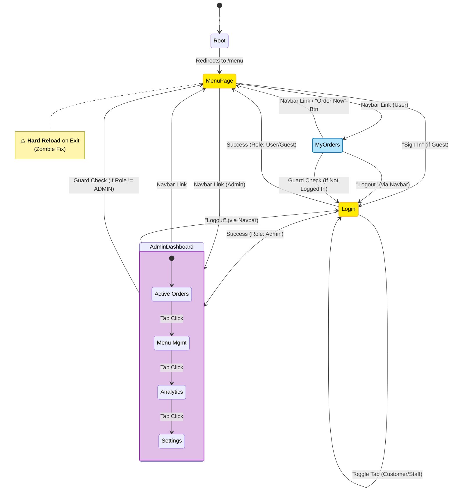

# Frontend Page Flow & State Analysis

## 1. Overview
This document analyzes the navigation logic for the Mini Restaurant App, covering the **Host App** and its two remote micro-frontends: **Menu App** and **Admin App**.

## 2. Mermaid State Diagram

> **Legend**:
> - `[State]`: Page or Route.
> - `(*) -> [State]`: Initial entry points.
> - `<<Shared>>`: Nodes used by multiple roles/flows.
> - **Solid Arrow**: User/Programmatic navigation.
> - **Dotted Arrow**: Automated Redirects (Guards/Logic).

## 3. Function Path Mapping

| Function | Start Node | Intermediate Nodes | End Node | Logic / Guard |
| :--- | :--- | :--- | :--- | :--- |
| **Guest Entry** | `Root /` | `Redirect` | `MenuPage` | Default Route |
| **Quick Login** | `MenuPage` | `Login` -> `Quick Login API` | `MenuPage` / `MyOrders` | Stays on previous or default |
| **Admin Access** | `Login` | `Staff Login API` | `AdminDashboard` | Role Check: `ROLE_ADMIN` |
| **View History** | `MenuPage` | `Navbar` | `MyOrders` | Role Check: `ROLE_USER` |
| **Logout** | Any | `Navbar` -> `Clear Token` | `Login` | Global Logout |
| **Empty Order** | `MyOrders` | "Order Now" Button | `MenuPage` | Empty State UI |

## 4. Conflict & Risk Analysis

### 4.1 "Zombie" Fix Hard Reload
- **Location**: `MenuPage.vue` -> `onBeforeRouteLeave`
- **Logic**: `window.location.href = to.fullPath`
- **Impact**: Any navigation **away** from `/menu` causes a full browser page reload. This breaks Single Page Application (SPA) smoothness but is currently necessary to prevent CSS/JS conflicts between Module Federation remotes.
- **Risk**: Slower transitions when moving from Menu to Admin or My Orders.

### 4.2 Auth State Consistency
- **Location**: `App.vue` -> `watch(() => route.path)`
- **Logic**: Re-checks `localStorage` token on every route change to update `isAdmin` state.
- **Risk**: If `localStorage` is modified manually, the UI updates reactively, but the backend JWT validation is the ultimate source of truth.

### 4.3 Guest vs User "My Orders"
- **Location**: `MyOrders.vue`
- **Logic**: Complex dual logic to handle `Guest Token` (localStorage) vs `User Token` (JWT).
- **Risk**: High complexity. If a user logs in while having a guest session, merge logic is implicit or missing.

## 5. Regression Test Paths

Please execute the following paths to verify navigation integrity:

### 5.1 Guest Flow
1.  **[Guest Landing]**: Open `/` -> Verify redirect to `/menu`.
2.  **[Guest Access Orders]**: Click "My Orders" (if visible) or manually navigate -> Verify Redirect to `/login` (Guard).

### 5.2 Customer Flow
1.  **[Login Redirect]**: Open `/my-orders` directly (Logged out) -> Check redirect to `/login` -> Perform Login -> Verify redirect back to `/my-orders`.
2.  **[Empty State Nav]**: In `/my-orders` (with no orders), click "Order Now" -> Verify navigation to `/menu`.
3.  **[Logout]**: Click "Logout" -> Verify navigation to `/login`.

### 5.3 Admin Flow
1.  **[Admin Login]**: Login as Admin -> Verify landing on `/admin`.
2.  **[Dash Tabs]**: Click "Menu Management" tab -> Verify component switch (No URL change).
3.  **[Unauthorized Access]**: Login as User -> Manually type `/admin` -> Verify alert + redirect to `/menu`.
4.  **[Zombie Check]**: From `/menu`, click `/admin` (as Admin) -> Verify Page Reload (observable flicker) due to Zombie Fix.
