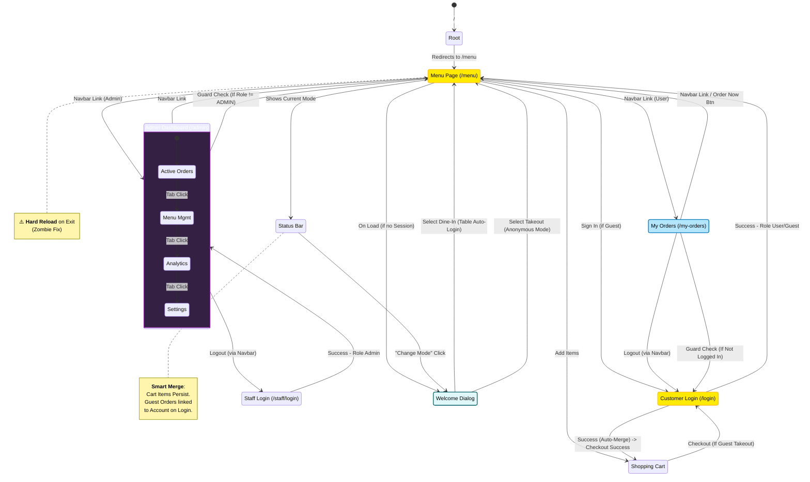

# Frontend Page Flow & State Analysis

## 1. Overview
This document analyzes the navigation logic for the Mini Restaurant App, covering the **Host App** and its two remote micro-frontends: **Menu App** and **Admin App**.

## 2. Mermaid State Diagram

> **Legend**:
> - `[State]`: Page or Route.
> - `(*) -> [State]`: Initial entry points.
> - `<<Shared>>`: Nodes used by multiple roles/flows.
> - **Solid Arrow**: User/Programmatic navigation.
> - **Dotted Arrow**: Automated Redirects (Guards/Logic).

## 3. Function Path Mapping

| Function | Start Node | Intermediate Nodes | End Node | Logic / Guard |
| :--- | :--- | :--- | :--- | :--- |
| **Guest Entry** | `Root /` | `Redirect` | `MenuPage` -> `WelcomeDialog` | Default Route |
| **Quick Login** | `MenuPage` | `Login` -> `Quick Login API` | `MenuPage` / `MyOrders` | Customer Flow |
| **Admin Access** | `Direct URL` | `StaffLogin` -> `Staff Login API` | `AdminDashboard` | Role Check: `ROLE_ADMIN` |
| **Switch Mode** | `MenuPage` | `Status Bar` -> `Change Mode` -> `WelcomeDialog` | `MenuPage` | **Smart Merge**: Keeps Cart |
| **View History** | `MenuPage` | `Navbar` | `MyOrders` | Role Check: `ROLE_USER` |
| **Logout (User)** | `MyOrders` / `MenuPage` | `Navbar` -> `Clear Token` | `Login` | Role: USER/GUEST |
| **Logout (Admin)** | `AdminDashboard` | `Navbar` -> `Clear Token` | `StaffLogin` | Role: ADMIN |
| **Empty Order** | `MyOrders` | "Order Now" Button | `MenuPage` | Empty State UI |

## 4. Conflict & Risk Analysis

### 4.1 "Zombie" Fix Hard Reload
- **Location**: `MenuPage.vue` -> `onBeforeRouteLeave`
- **Logic**: `window.location.href = to.fullPath`
- **Impact**: Any navigation **away** from `/menu` causes a full browser page reload. This breaks Single Page Application (SPA) smoothness but is currently necessary to prevent CSS/JS conflicts between Module Federation remotes.
- **Risk**: Slower transitions when moving from Menu to Admin or My Orders.

### 4.2 Auth State Consistency
- **Location**: `App.vue` -> `watch(() => route.path)`
- **Logic**: Re-checks `localStorage` token on every route change to update `isAdmin` state.
- **Risk**: If `localStorage` is modified manually, the UI updates reactively, but the backend JWT validation is the ultimate source of truth.

### 4.3 Dining Mode Reactivity & "Smart Merge"
- **Location**: `MenuPage.vue` (Sub-App) & `App.vue` (Host)
- **Problem**: Host App needs to know if user is "Dine-In #5" to show in Navbar, but logic is in Sub-App.
- **Solution**:
    1.  Sub-App writes `diningInfo` to LocalStorage.
    2.  Sub-App dispatches `window.dispatchEvent(new Event('auth-change'))`.
    3.  Host App listens to `auth-change` and updates Navbar.
- **Smart Merge Risk**: When switching mode, we clear the Token (Auth) but **keep the Cart Store**. This means a user could technically prepare an order as "Guest A" and submit it as "Guest B". In our business logic, this is a **feature**, not a bug (merging intent).

## 5. Regression Test Paths

Please execute the following paths to verify navigation integrity:

### 5.1 Guest Flow
1.  **[Guest Landing]**: Open `/` -> Verify redirect to `/menu` -> Select Mode (Dine-In).
2.  **[Status Bar Check]**: Verify Status Bar shows "Dining In".
3.  **[Guest Access Orders]**: Click "My Orders" -> Verify Page Loads (Auto-Login successful).

### 5.2 Switch Mode Flow (New)
1.  **[Add Item]**: Add items to cart in Dine-In mode.
2.  **[Change Mode]**: Click "Change Mode" in Status Bar -> Select **Takeout** (Phone Login).
3.  **[Verify Merge]**: Confirm items remain in Cart -> Status Bar shows "Takeout".

### 5.3 Admin Flow
1.  **[Admin Login]**: Login as Admin -> Verify landing on `/admin`.
2.  **[Dash Tabs]**: Click "Menu Management" tab -> Verify component switch (No URL change).
3.  **[Unauthorized Access]**: Login as User -> Manually type `/admin` -> Verify alert + redirect to `/menu`.
4.  **[Zombie Check]**: From `/menu`, click `/admin` (as Admin) -> Verify Page Reload (observable flicker) due to Zombie Fix.

## 6. Test Accounts

Use the following credentials for Playwright automation scripts:

| Role | Username / Identifier | Password | Notes |
| :--- | :--- | :--- | :--- |
| **Admin** | `admin` | `123456` | Full access to Admin Dashboard |
| **Customer (Dine-in)** | N/A | N/A | Auto-Login via Table Selection |
| **Customer (Takeout)** | `0955983983` | N/A | Mobile Number Quick Login |
