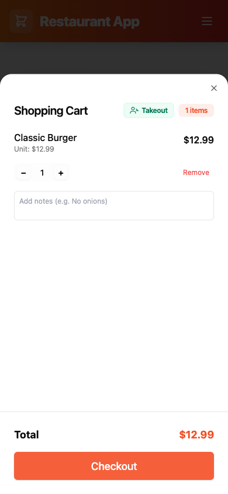
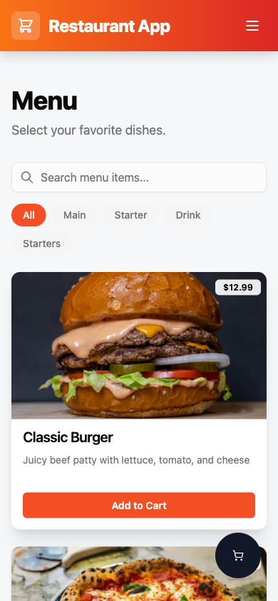
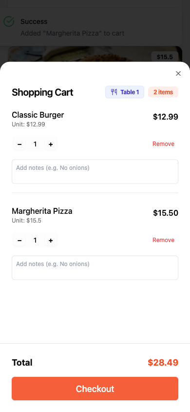
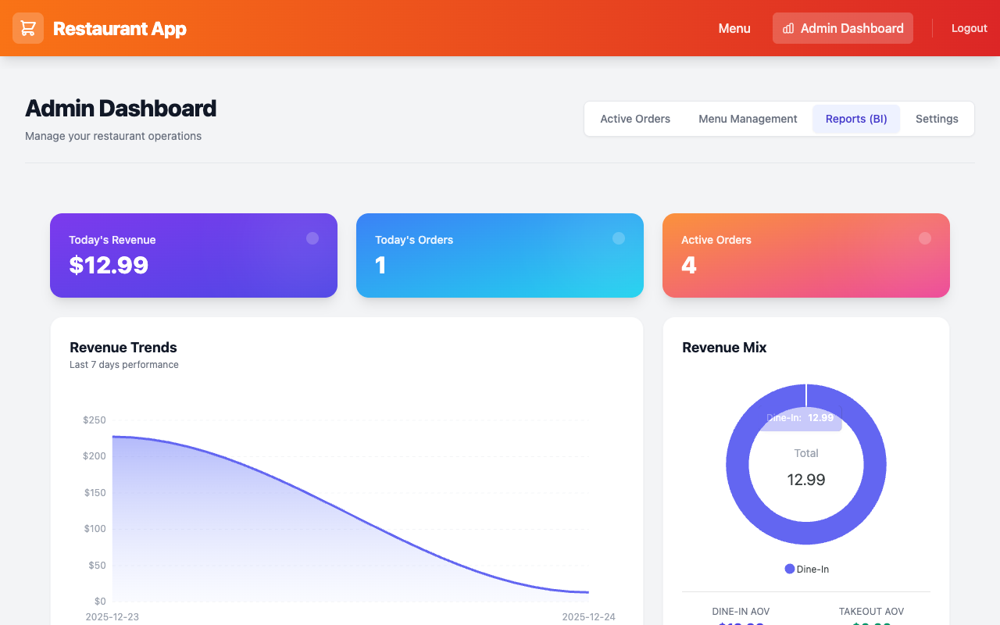

# User Manual - Mini Restaurant App

> **Note**: This manual focuses on the end-user experience for **Customers** and **Restaurant Staff**.
> For technical deployment and architecture details, please refer to [README.md](../README.md).

---

## 1. Introduction

Welcome to the **Mini Restaurant App**, a modern ordering platform designed for seamless dining experiences.

### Key Features
*   **For Customers**: Order from your phone (Dine-in or Takeout) with real-time status updates.
*   **For Staff**: A unified dashboard to manage kitchen preparation and counter pickups.

---

## 2. Getting Started

### Accessing the App
*   **Storefront / Admin**: [http://localhost:3000](http://localhost:3000)

### System Accounts
For testing or administrative access, use the following credentials:

| Role | Username | Password | Access |
| :--- | :--- | :--- | :--- |
| **Administrator** | `admin` | `123456` | Full Admin Dashboard access |
| **Customer** | *(Mobile Number)* | *(No Password)* | Storefront access (via Quick Login) |

---

## 3. Customer Guide

The app supports two main dining modes: **Takeout** and **Dine-in**.

### 3.1 Scenario A: Takeout (Quick Login)
Ideal for customers ordering ahead for pickup.

1.  **Select Mode**: Choose **Takeout** on the welcome screen.
2.  **Browse Menu**: Add items to your cart.
    > 
3.  **Checkout**:
    *   Open the Cart (Floating Button).
    *   Click **Checkout**.
    > 
4.  **Login**:
    *   You will be redirected to the Login page.
    *   Select the **Customer** tab.
    *   Enter your **Mobile Number** (e.g., `0912345678`).
    *   Click **Track Order / Quick Login**.
5.  **Payment**: After logging in, return to the cart to finalize (Pay Now).

### 3.2 Scenario B: Dine-in (Contactless)
Ideal for customers already seated at the restaurant.

1.  **Select Table**: Choose **Dine In** and select your **Table Number**.
2.  **Order**: Browse and add items. The menu will show your table number.
    > 
    > *Note: Pricing and availability are synced in real-time.*
3.  **Direct Checkout**:
    *   Review your cart.
    *   Click **Checkout**.
    *   **No Login Required**: The order is instantly sent to the kitchen for your table.
    > 

---

## 4. Admin Guide (Restaurant Staff)

### 4.1 Accessing the Dashboard
1.  Go to `http://localhost:3000/login`.
2.  Select the **Staff** tab.
3.  Values: `admin` / `123456`.
4.  Click **Login**.

### 4.2 Managing Orders
The Dashboard provides a real-time view of the restaurant's pulse.

> 

*   **Active Tab**: The default view showing all ongoing orders.
*   **Kitchen Tab**: Focused view for chefs. Shows only orders with status `PREPARING`.
*   **Counter Tab**: Focused view for waitstaff. Shows orders ready for pickup (`READY`).

### 4.3 Order Lifecycle
*   **Accept**: New orders arrive as `PENDING`. Click **Accept** to move them to the Kitchen (`PREPARING`).
*   **Ready**: When food is cooked, mark as **Ready** to notify the Counter.
*   **Complete**: When customer picks up the food, mark as **Completed**.

---

## 5. Troubleshooting

*   **White Screen?**: Ensure all micro-frontends are running (`npm run preview` in sub-apps).
*   **Login Failed?**: Check that the backend services (`auth-service`, `gateway`) are running in Docker.
*   **Wrong Table?**: If you selected the wrong table in Dine-in mode, refresh the page to reset the session or clear your browser cookies.
