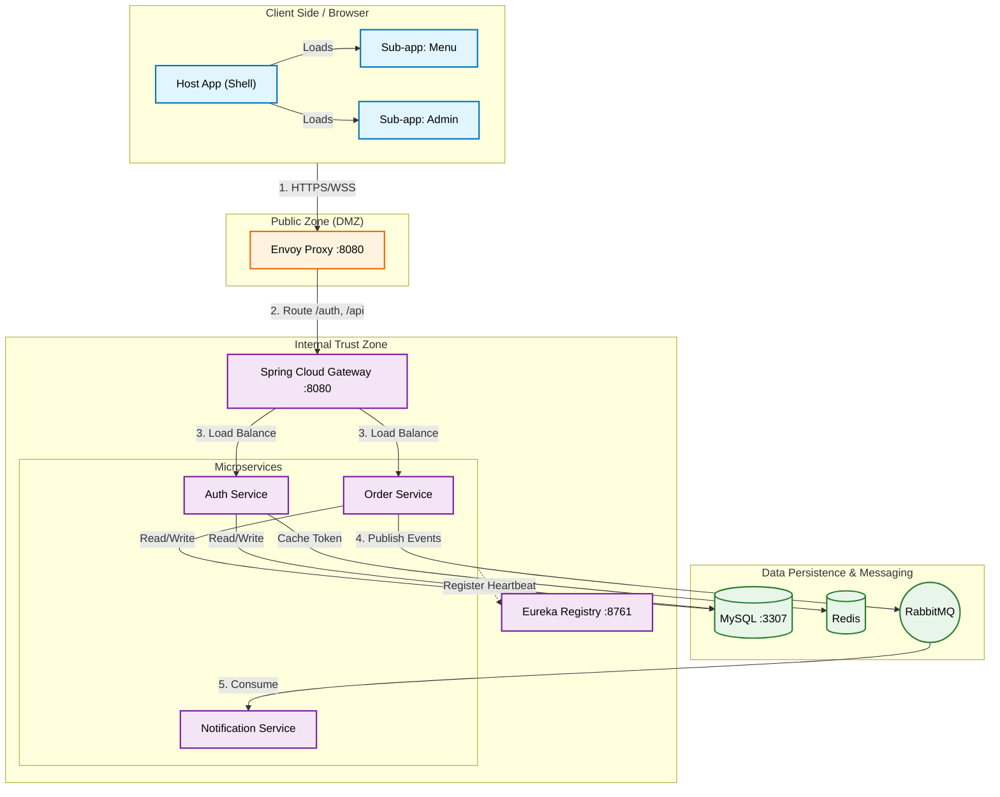
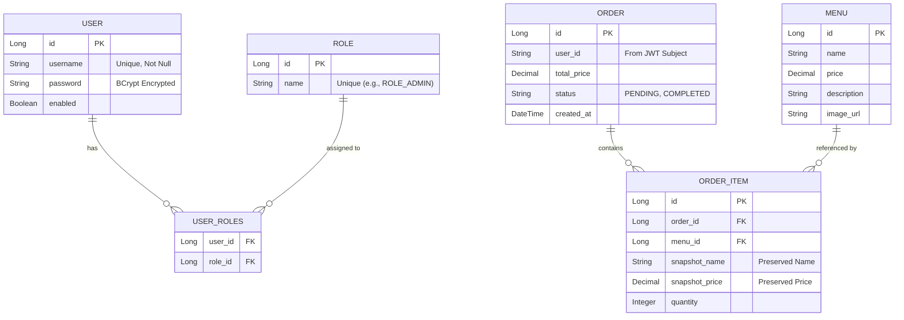

# 系統設計規格書：Mini Restaurant App

> **版本**：1.1 (發布於：2025-12-21)
> **狀態**：開發中 (Active Development)
> **作者**：Antigravity AI Agent

---

## 1. 執行摘要 (Executive Summary)

**Mini Restaurant App** 是一個可擴展的雲原生電子商務平台，旨在展示現代軟體架構。其功能包括：
1.  **客戶操作**：瀏覽菜單、管理購物車及下單。
2.  **Admin 操作**：訂單管理與 Dashboard 監控。

本系統建立於 **Microservices** 後端 (Spring Cloud) 與 **Micro-frontend** 客戶端 (Vue 3 Module Federation) 之上，強調關注點分離、可擴展性與安全性。

---

## 2. 高階架構 (High-Level Architecture)

### 2.1 流量拓撲 (Traffic Flow Topology)
網路拓撲實作了「縱深防禦 (Defense in Depth)」策略，劃分為三個不同區域。

### 2.2 元件角色 (Component Roles)
-   **Envoy Proxy**: Edge 入口點，負責 TLS 終止 (計畫中)。
-   **Spring Cloud Gateway**: 內部路由、JWT 驗證攔截器、請求日誌記錄。
-   **Eureka**: 用於動態服務發現 (Service Discovery) 的 Service Registry。
-   **Microservices**: 特定領域邏輯容器 (Auth, Order, Notification)。

---

## 3. 資料設計與 Schema (ERD)

系統使用 **MySQL 8.0** 作為關聯式資料持久層。Schema 雖然分散在各個服務的邏輯資料庫中 (如 `auth_db`, `order_db`)，但在此處以統一視圖呈現。

### 3.1 實體關聯圖 (Entity Relationship Diagram)

### 3.2 設計模式 (Design Patterns)
-   **Snapshot Pattern**: `ORDER_ITEM` 在購買當下儲存 `snapshot_name` 與 `snapshot_price`。這能防止若後續 `MENU` 項目更新時，歷史訂單的資料發生變動。
-   **Loose Coupling (鬆散耦合)**: `ORDER` 資料表透過字串 `user_id` (來自 JWT) 連結至 `USER`，而非資料庫 Foreign Key。這確保了 Microservice 間的獨立性。

---

## 4. 安全架構 (Security Architecture)

### 4.1 認證流程 (RSA + BCrypt)
針對登入使用了強健的「傳輸中加密 (Encryption in Transit)」機制。

1.  **取得公鑰**: Client `GET /auth/public-key`。
2.  **加密**: Client 使用 RSA (`JSEncrypt`) 加密密碼。
3.  **傳輸**: 將加密後的 Payload 發送至 `POST /auth/login`。
4.  **解密**: Backend 使用儲存的 Private Key 進行解密。
5.  **驗證**: 解密後的密碼與 DB 中的 `BCrypt` hash 進行比對驗證。

### 4.2 授權 (JWT + RBAC)
-   **Token 格式**: 標準 JWT (HS256)。
-   **Claims**: `sub` (使用者名稱), `roles` (["ROLE_ADMIN", ...]), `exp`。
-   **強制執行**:
    -   **Gateway**: 驗證簽章。
    -   **Service Layer**: `@PreAuthorize("hasRole('ADMIN')")` 保護特定 Endpoints。

---

## 5. 微前端 (Micro-Frontends: Module Federation)

我們使用 **Vite Plugin Federation** 在執行階段 (Runtime) 組裝 UI。

| App Name | Type | Mount Point | Responsibility |
| :--- | :--- | :--- | :--- |
| **Host App** | Shell | `/` | 版面配置 (Layout), 路由 (Routing), Auth 狀態 (Pinia) |
| **Menu App** | Remote | `/` | 美食菜單, 購物車 |
| **Admin App** | Remote | `/admin` | Dashboard, 訂單管理 |

**限制**: Remote Apps 必須以 `preview` 模式 (`npm run preview`) 建置並提供服務，以便在本地開發期間正確暴露 `remoteEntry.js`。

---

## 6. 技術棧 (Technology Stack)

| Layer | Technology | Details |
| :--- | :--- | :--- |
| **Backend** | Java 17 | 核心語言 |
| | Spring Boot 3.2 | 應用程式框架 |
| | Spring Cloud 2023 | Gateway, Eureka, OpenFeign |
| | RabbitMQ | 非同步訊息處理 (Async Messaging) |
| | MySQL 8.0 | 主要資料庫 |
| | Redis | 快取 & 使用者 Session |
| **Frontend** | Vue 3.5 | Composition API |
| | Vite 7.2 | 建置工具 & Dev Server |
| | Tailwind CSS 3.4 | Utility-first Styling |
| | Pinia | 狀態管理 |

---

## 7. API 目錄 (關鍵 Endpoints)

### 7.1 Auth Service (`/api/auth`)
| Method | Endpoint | Access | Description |
| :--- | :--- | :--- | :--- |
| `POST` | `/login` | Public | 驗證使用者 (RSA 加密密碼)，回傳 JWT + Roles。 |
| `POST` | `/register` | Public | 註冊新使用者 (RSA 加密密碼)。 |
| `GET` | `/public-key` | Public | 回傳 RSA Public Key 供前端加密使用。 |
| `GET` | `/verify` | Public | 驗證 JWT Token。 |

### 7.2 Order Service (`/api/orders`)
| Method | Endpoint | Access | Description |
| :--- | :--- | :--- | :--- |
| `POST` | `/create` | Authenticated | 建立含項目的新訂單。發布事件至 RabbitMQ。 |
| `GET` | `/my` | Authenticated | 取得當前登入使用者的訂單歷史記錄。 |
| `GET` | `/admin/all` | **Admin** | 取得系統中所有訂單。 |
| `PATCH` | `/{id}/status` | **Admin** | 更新訂單狀態 (例如：`PAID` -> `PREPARING` -> `COMPLETED`)。 |

### 7.3 Admin 功能 (Capabilities)
-   **Dashboard**: 透過 `/admin` (Front) 與 `/api/orders/admin/all` (Back) 存取。
-   **角色檢查**: 需要 JWT `roles` 列表中包含 `ROLE_ADMIN`。

### 7.4 後端監控 (Actuator)
| Method | Endpoint | Access | Description |
| :--- | :--- | :--- | :--- |
| `GET` | `/actuator/**` | **Public** | 暴露營運資訊 (Health, Metrics, Env, Loggers) 供 Spring Boot Admin 使用。 |
| `GET` | `/actuator/prometheus` | **Public** | 以 Prometheus 格式暴露 Metrics 供抓取。 |

> **注意**: 對於 `auth-service`, `gateway-service`, `order-service`, 和 `notification-service`，這些 Endpoints 是完全暴露的 (`*`) 以啟用深度監控。在 `auth-service` 中，這已在 `SecurityConfig` 中明確允許。

---

## 8. 部署與開發 (Deployment & Development)

### 8.1 Docker 環境
-   **啟動**: `docker-compose up --build -d`
-   **服務**: `mysql`, `redis`, `rabbitmq`, `registry`, `gateway`, `auth`, `order`, `envoy`。
-   **資料持久化**: 使用 Named Volume `mysql_data` 持久化 DB 狀態。

### 8.2 新增功能
1.  **Backend**: 新增 Module -> 更新 `pom.xml` -> 向 Eureka 註冊。
2.  **Frontend**: 建立 Vue App -> 設定 `vite.config.js` (Federation) -> 更新 Host Router。

---

## 9. 當前實作狀態 (v1.1)

-   **Admin UI**: 完成。基於卡片式佈局，具備高對比度。
-   **Auth**: 完成。MySQL 後端，RSA 保護。
-   **Order**: 核心流程完成。已實作 RabbitMQ Producer。
-   **進行中 (WIP)**: Notification Service (Consumer), Menu Management (CRUD)。

---
