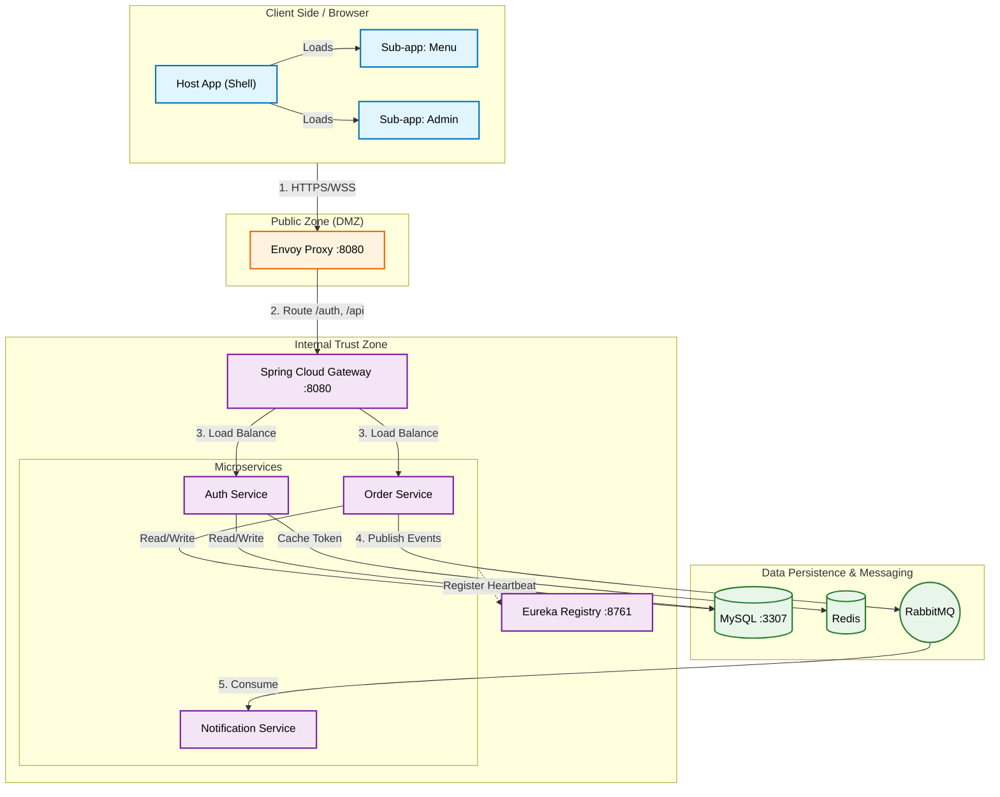
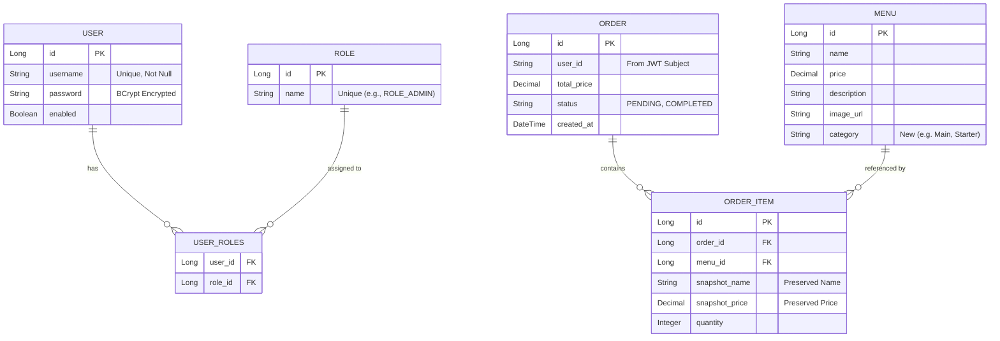

# 系統設計規格書：Mini Restaurant App

> **版本**：2.0 (發布於：2025-12-23)
> **狀態**：**商業營運級 / 生產就緒** (Commercial / Production-Ready)
> **作者**：Antigravity AI Agent

---

## 1. 執行摘要 (Executive Summary)

**Mini Restaurant App** 是一個可擴展的雲原生電子商務平台，其架構目標已從 MVP 升級為 **真實世界的商業營運系統**。本系統旨在處理跨區域部署、複雜時區管理以及高併發流量。

其功能包括：
1.  **客戶操作**：瀏覽菜單、管理購物車、下單及自助取消訂單。
2.  **Admin 操作**：即時儀表板監控 (Real-time Dashboard)、商業智慧報表 (BI Analytics) 與 AI 輔助菜單管理。
3.  **全球化就緒 (Global Readiness)**：支援多時區營運、i18n 架構以及高標準資安規範。
4.  **無縫體驗**：延遲登入 (Lazy Login) 與 手機號碼快速登入 (Quick Login) 流程。

本系統建立於 **Microservices** 後端 (Spring Cloud) 與 **Micro-frontend** 客戶端 (Vue 3 Module Federation) 之上，強調關注點分離、可擴展性、安全性與極致的用戶體驗。

---

## 2. 高階架構 (High-Level Architecture)

### 2.1 流量拓撲 (Traffic Flow Topology)
網路拓撲實作了「縱深防禦 (Defense in Depth)」策略，劃分為三個不同區域。

### 2.2 元件角色 (Component Roles)
-   **Envoy Proxy**: Edge 入口點，負責 TLS 終止 (計畫中)。
-   **Spring Cloud Gateway**: 內部路由、JWT 驗證攔截器、請求日誌記錄。
-   **Eureka**: 用於動態服務發現 (Service Discovery) 的 Service Registry。
-   **Microservices**: 特定領域邏輯容器 (Auth, Order, Notification)。

---

## 3. 資料與業務邏輯 (Data & Business Logic)

系統使用 **MySQL 8.0** 作為關聯式資料持久層。Schema 雖然分散在各個服務的邏輯資料庫中 (如 `auth_db`, `order_db`)，但在此處以統一視圖呈現。

### 3.1 實體關聯圖 (Entity Relationship Diagram)

### 3.2 設計模式 (Design Patterns)
-   **Snapshot Pattern**: `ORDER_ITEM` 在購買當下儲存 `snapshot_name` 與 `snapshot_price`。這能防止若後續 `MENU` 項目更新時，歷史訂單的資料發生變動。
-   **Loose Coupling (鬆散耦合)**: `ORDER` 資料表透過字串 `user_id` (來自 JWT) 連結至 `USER`，而非資料庫 Foreign Key。這確保了 Microservice 間的獨立性。

### 3.3 訂單生命週期時序圖 (Order Lifecycle Sequence)

```mermaid
sequenceDiagram
    autonumber
    actor User as User (Customer)
    participant FE as Sub-app-Menu
    participant Envoy as Envoy Proxy
    participant GW as Gateway Service
    participant Auth as Auth Service (JWT)
    participant Order as Order Service
    participant DB as MySQL DB
    participant MQ as RabbitMQ
    participant Notif as Notification Service

    %% Phase 1: Authentication
    note over User, Auth: Prerequisite: User Login (RSA Encrypted Password)
    User->>FE: Enter Credentials
    FE->>FE: Encrypt Password (RSA Public Key)
    FE->>Auth: POST /auth/login {user, enc_pass}
    Auth->>DB: Verify Hash (BCrypt)
    Auth-->>FE: Return JWT Token (in Response Body)

    %% Phase 2: Order Creation
    note over User, Notif: Main Flow: Place Order
    User->>FE: Click "Checkout"
    FE->>Envoy: POST /api/orders
    Note right of FE: Header: Authorization: Bearer {JWT}
    Note right of FE: Header: X-User-Id: {userId}
    
    Envoy->>GW: Forward Request
    GW->>Order: Route to Order Service
    
    rect rgb(30, 30, 30)
        note right of GW: Security Context
        Order->>Order: JwtAuthenticationFilter: Validate Signature
        Order->>Order: Extract Roles & UserID
    end

    Order->>DB: Fetch "Menu" Items
    
    %% Snapshot Logic
    rect rgb(50, 50, 50)
        note right of Order: Data Integrity (Snapshot)
        Order->>Order: Create Order Entity
        loop For each Item
            Order->>Order: Copy Name & Price to OrderItem
        end
        Order->>DB: SAVE Order (Commit)
    end
    
    %% Messaging
    Order->>MQ: Publish to "order.exchange"
    Note right of Order: Routing Key: "order.create"
    Order-->>FE: 200 OK (Order JSON)
    FE-->>User: Show "Order Success"

    %% Phase 3: Notification
    MQ->>Notif: Consume Message
    Notif->>Notif: Log / Push WebSocket
    note right of Notif: "New Order #123 Received"
```

### 3.4 顧客取消訂單 (New)
為了減少摩擦，顧客可以在嚴格條件下取消自己的訂單：
-   **觸發**：在 `MyOrders` UI 中點擊「取消訂單」。
-   **Endpoint**: `PATCH /api/orders/{id}/cancel`。
-   **條件**：訂單狀態 **必須** 為 `PENDING`。
-   **結果**：
    1.  狀態更新為 `CANCELLED`。
    2.  發布 `order.cancelled` 事件至 RabbitMQ。
    3.  Admin Dashboard 透過 WebSocket 更新 (移至歷史分頁)。
    4.  庫存不會被扣除 (因為庫存邏輯屬於 V2)。

### 3.5 管理員訂單管理時序圖 (Admin Order Management Sequence)

```mermaid
sequenceDiagram
    autonumber
    actor Admin as Admin User
    participant FE as Sub-app-Admin
    participant GW as Gateway / Envoy
    participant Auth as Auth Service
    participant Order as Order Service
    participant DB as MySQL DB
    participant MQ as RabbitMQ
    participant Notif as Notification Service

    %% Phase 1: View Active Orders
    note over Admin, Order: Scenario: Admin Views Dashboard
    Admin->>FE: Open Dashboard
    FE->>GW: GET /api/orders/admin/all
    Note right of FE: Header: Authorization: Bearer {JWT}
    
    GW->>Order: Forward Request
    
    rect rgb(30,30,30)
        note right of GW: RBAC Check (權限檢查)
        Order->>Order: Validate JWT
        Order->>Order: Check Role == ROLE_ADMIN
        alt is Authorized
             Order->>DB: Fetch All Orders
             Order-->>FE: Return List [Order A, Order B...]
        else is Unauthorized
             Order-->>FE: 403 Forbidden
        end
    end

    %% Phase 2: Update Status
    note over Admin, Notif: Scenario: Admin Accepts Order
    Admin->>FE: Click "Accept Order"
    FE->>GW: PATCH /api/orders/admin/{id}/status {status: PREPARING}
    GW->>Order: Forward Request
    
    Order->>Order: Verify ROLE_ADMIN
    Order->>DB: Update Status -> PREPARING
    
    %% Phase 3: Async Notification
    Order->>MQ: Publish "order.update"
    Note right of Order: Routing Key: "order.create" or "order.update"
    Order-->>FE: 200 OK (Updated Order)
    FE-->>Admin: Show "Order Accepted" Toast

    %% Phase 4: Notify User
    MQ->>Notif: Consume Message
    Notif->>Notif: Push WebSocket Notification
    note right of Notif: "Your order is being prepared!"
```

### 3.5 管理後台狀態對應 (Status Mapping)

為了簡化廚房作業流程，管理儀表板根據其生命週期狀態將訂單過濾到不同的分頁標籤中。

| 儀表板分頁 (Tab) | 包含的狀態 (後端 Enum) | 用途 |
| :--- | :--- | :--- |
| **Active** | `PENDING`, `PAID`, `PREPARING`, `READY` | **預設視圖**。顯示目前流程中所有可操作的訂單。 |
| **Pending** | `PENDING`, `PAID` | 等待餐廳接單的新訂單。 |
| **Kitchen** | `PREPARING` | 已接單且目前正在製作/組裝的訂單。 |
| **Counter** | `READY` | 已製作完成並等待顧客取餐的訂單。 |
| **History** | `COMPLETED`, `CANCELLED` | 已完成交易的存檔。採用 Lazy-load 以提升效能。 |

---

## 4. 安全架構 (Security Architecture)

### 4.1 認證流程 (RSA + BCrypt)
針對登入使用了強健的「傳輸中加密 (Encryption in Transit)」機制。

1.  **取得公鑰**: Client `GET /auth/public-key`。
2.  **加密**: Client 使用 RSA (`JSEncrypt`) 加密密碼。
3.  **傳輸**: 將加密後的 Payload 發送至 `POST /auth/login`。
4.  **解密**: Backend 使用儲存的 Private Key 進行解密。
5.  **驗證**: 解密後的密碼與 DB 中的 `BCrypt` hash 進行比對驗證。

### 4.2 授權 (JWT + RBAC)
-   **Token 格式**: 標準 JWT (HS256)。
-   **Claims**: `sub` (使用者名稱), `roles` (["ROLE_ADMIN", ...]), `exp`。
-   **強制執行**:
    -   **Gateway**: 驗證簽章。
    -   **Service Layer**: `@PreAuthorize("hasRole('ADMIN')")` 保護特定 Endpoints。

### 4.3 時區策略 (Global Timezone Strategy) - 嚴格執行
鑑於系統將面向全球，我們採用 "UTC Storage, Local Display" 策略並 **嚴格強制執行類型檢查**：

1.  **資料儲存 (Persistence)**:
    -   **嚴格規則**: 實體 **必須 (MUST)** 使用 `java.time.Instant` 作為所有時間戳記欄位。
    -   **禁止**: 嚴格禁止使用 `LocalDateTime` 進行持久化。
    -   所有時間戳記 (TimeStamp) 在資料庫中一律儲存為 **UTC**。
    -   禁止依賴資料庫伺服器的本地時間。

2.  **業務邏輯 (Business Logic)**:
    -   **營運報表**: "Today" 的定義依賴於 **餐廳所在地時區 (Restaurant Timezone)**，而非伺服器或使用者時區。
    -   *例如*: 東京餐廳的 "今日營收" 應從 00:00 JST (15:00 UTC Prev Day) 開始計算。
    -   目前 MVP 階段預設使用伺服器時間，未來將引入 `RestaurantSettings` 實體來配置時區。

3.  **前端顯示 (Presentation)**:
    -   API 一律回傳 ISO 8601 UTC 格式 (e.g., `2023-12-23T10:00:00Z`)。
    -   瀏覽器根據使用者本地設定將其轉換為當地時間顯示 (`new Date().toLocaleString()`)。

### 4.4 深入探討：時區資料流 (Frontend <-> Backend <-> DB)

在分散式系統中，確保各種運算環境下的時間一致性是一大挑戰。我們解決此問題的方法是：後端實體全面標準化使用 `Instant`，而非 `LocalDateTime`。

#### "LocalDateTime" 的陷阱
`LocalDateTime` 代表的是「牆鐘時間 (Wall Clock)」(例如 "10:00 AM")，它不包含任何時區情境。
- **歧義性**: 當前端發送 `2025-12-25T10:00:00Z` (UTC) 時，將其解析為 `LocalDateTime` 會導致 `Z` (UTC 標記) 被剝離。
- **資料損壞**: 如果資料庫伺服器位於 `UTC+8`，儲存數字 "10:00" 可能被 JDBC Driver 解讀為「台灣時間 10:00」，而非原本的「UTC 10:00」，從而導致 8 小時的偏差錯誤。

#### "Instant" 的解法
`Instant` 代表的是宇宙時間軸上的一個絕對點。
- **精確性**: 它明確地將時間戳記處理作 UTC 的一個時刻。
- **安全性**: JDBC Driver 一旦識別出 `Instant`，便會處理必要的轉換，將其轉換為資料庫的原生儲存格式 (如 `TIMESTAMP`)，並在轉換過程中保留確切的時間點，無論伺服器的本地時區設定為何。

#### 互動流程圖

```mermaid
sequenceDiagram
    autonumber
    participant FE as Frontend (Browser)
    participant JSON as JSON Parser (Jackson)
    participant BE as Backend (Java Code)
    participant JDBC as JDBC Driver
    participant DB as MySQL Database

    Note over FE: 使用者在台灣 (UTC+8)<br/>選擇時間: 18:00 (晚上6點)

    FE->>FE: 轉換為 ISO String (UTC)<br/>18:00 (TW) -> 10:00 (UTC)<br/>字串: "2025-12-25T10:00:00Z"
    FE->>BE: 發送 API請求: { "date": "2025-12-25T10:00:00Z" }

    rect rgb(60, 20, 20)
    Note right of FE: 修復前：使用 LocalDateTime
    BE->>JSON: 解析 JSON
    JSON-->>BE: 產出 LocalDateTime<br/>值為 "2025-12-25T10:00:00"<br/>❌ "Z" 被無視，變成了「相對時間」
    
    BE->>JDBC: 準備存入 DB
    Note right of BE: 這裡語意模糊：<br/>後端只給了 "10:00" 這個數字
    
    JDBC->>DB: 執行 INSERT
    Note right of DB: 😱 錯誤發生點：<br/>MySQL 收到 "10:00"。<br/>若 DB session 是 UTC+8，<br/>它可能將其存為 "10:00 (TW time)"。<br/>(實際時間點變成了 UTC 02:00，差了8小時)
    end

    rect rgb(20, 60, 20)
    Note right of FE: 修復後：使用 Instant
    BE->>JSON: 解析 JSON
    JSON-->>BE: 產出 Instant<br/>值為 "2025-12-25T10:00:00Z"<br/>✅ 鎖定為 UTC 絕對時刻
    
    BE->>JDBC: 準備存入 DB
    Note right of BE: 語意精確：<br/>"這是 UTC 的 10:00"
    
    JDBC->>DB: 執行 INSERT
    Note right of DB: 😃 正確轉換：<br/>JDBC Driver 知道這是 Instant。<br/>它會根據與 DB 的協定，<br/>確保寫入的時間點等同於 UTC 10:00。<br/>(若 DB 存 TIMESTAMP，就是 UTC 10:00)
    end

    Note over DB, FE: 讀取流程 (Instant)
    DB->>JDBC: 讀取資料 (TIMESTAMP/DATETIME)
    JDBC->>BE: 轉換回 Instant (UTC 10:00Z)
    BE->>FE: 回傳 JSON "2025-12-25T10:00:00Z"
    FE->>FE: 瀏覽器轉回本地時間顯示 (18:00)
```

---

## 5. 微前端 (Micro-Frontends: Module Federation)

我們使用 **Vite Plugin Federation** 在執行階段 (Runtime) 組裝 UI。

| App Name | Type | Mount Point | Responsibility |
| :--- | :--- | :--- | :--- |
| **Host App** | Shell | `/` | 版面配置 (Layout), 路由 (Routing), Auth 狀態 (Pinia) |
| **Menu App** | Remote | `/` | 美食菜單, 購物車 |
| **Admin App** | Remote | `/admin` | Dashboard, 訂單管理 |

**限制**: Remote Apps 必須以 `preview` 模式 (`npm run preview`) 建置並提供服務，以便在本地開發期間正確暴露 `remoteEntry.js`。

---

## 6. 技術棧 (Technology Stack)

| Layer | Technology | Details |
| :--- | :--- | :--- |
| **Backend** | Java 17 | 核心語言 |
| | Spring Boot 3.2 | 應用程式框架 |
| | Spring Cloud 2023 | Gateway, Eureka, OpenFeign |
| | RabbitMQ | 非同步訊息處理 (Async Messaging) |
| | MySQL 8.0 | 主要資料庫 |
| | Redis | 快取 & 使用者 Session |
| **Frontend** | Vue 3.5 | Composition API |
| | Vite 7.2 | 建置工具 & Dev Server |
| | Tailwind CSS 3.4 | Utility-first Styling |
| | Pinia | 狀態管理 |

### 6.1 UI 設計準則 (UI Standards)
-   **通知 (Notifications)**: 嚴格禁止使用瀏覽器原生 `alert()` 或 `confirm()` (除開發階段 Debug 外)。所有使用者回饋必須使用統一的 **Toast Notification** 元件。
-   **風格 (Styling)**: 遵循 Tailwind CSS Utility-first 原則，但在高階元件 (Cards, Buttons) 上保持語意一致性。

---

## 7. API 目錄 (關鍵 Endpoints)

> **API 文件規格 (Unified Gateway)**: 
> - **統一入口 (Gateway)**: [http://localhost:8088/webjars/swagger-ui/index.html](http://localhost:8088/webjars/swagger-ui/index.html)
> - **使用方式**: 請於頁面右上角選單選擇 "Auth Service" 或 "Order Service"。
> - **OpenAPI Specs**: `/api/auth/v3/api-docs` (via Gateway).

### 7.1 Auth Service (`/api/auth`)
| Method | Endpoint | Access | Description |
| :--- | :--- | :--- | :--- |
| `POST` | `/login` | Public | 驗證使用者 (RSA 加密密碼)，回傳 JWT + Roles。 |
| `POST` | `/quick-login` | Public | **(New)** 透過手機號碼自動註冊使用者 (Mobile First)。 |
| `POST` | `/register` | Public | 註冊新使用者 (RSA 加密密碼)。 |
| `GET` | `/public-key` | Public | 回傳 RSA Public Key 供前端加密使用。 |
| `GET` | `/verify` | Public | 驗證 JWT Token。 |

### 7.2 Order Service (`/api/orders`)
| Method | Endpoint | Access | Description |
| :--- | :--- | :--- | :--- |
| `POST` | `/create` | Authenticated | 建立含項目的新訂單。發布事件至 RabbitMQ。 |
| `GET` | `/my` | Authenticated | 取得當前登入使用者的訂單歷史記錄。 |
| `PATCH` | `/{id}/cancel` | Authenticated | **(New)** 取消狀態為 `PENDING` 的訂單 (限本人)。 |
| `GET` | `/admin/all` | **Admin** | 取得系統中所有訂單。 |
| `PATCH` | `/{id}/status` | **Admin** | 更新訂單狀態 (例如：`PAID` -> `PREPARING` -> `COMPLETED`)。 |

### 7.3 Admin 功能 (Capabilities)
-   **Dashboard**: 透過 `/admin` (Front) 與 `/api/orders/admin/all` (Back) 存取。
-   **角色檢查**: 需要 JWT `roles` 列表中包含 `ROLE_ADMIN`。

### 7.4 後端監控 (Actuator)
| Method | Endpoint | Access | Description |
| :--- | :--- | :--- | :--- |
| `GET` | `/actuator/**` | **Public** | 暴露營運資訊 (Health, Metrics, Env, Loggers) 供 Spring Boot Admin 使用。 |
| `GET` | `/actuator/prometheus` | **Public** | 以 Prometheus 格式暴露 Metrics 供抓取。 |

> **注意**: 對於 `auth-service`, `gateway-service`, `order-service`, 和 `notification-service`，這些 Endpoints 是完全暴露的 (`*`) 以啟用深度監控。在 `auth-service` 中，這已在 `SecurityConfig` 中明確允許。

---

## 8. 部署與開發 (Deployment & Development)

### 8.1 Docker 環境
-   **啟動**: `docker-compose up --build -d`
-   **服務**: `mysql`, `redis`, `rabbitmq`, `registry`, `gateway`, `auth`, `order`, `envoy`。
-   **資料持久化**: 使用 Named Volume `mysql_data` 持久化 DB 狀態。

### 8.2 新增功能
1.  **Backend**: 新增 Module -> 更新 `pom.xml` -> 向 Eureka 註冊。
2.  **Frontend**: 建立 Vue App -> 設定 `vite.config.js` (Federation) -> 更新 Host Router。

---

## 9. 當前實作狀態 (v1.1)

-   **Admin UI**: 完成。基於卡片式佈局，具備高對比度。
-   **Auth**: 完成。MySQL 後端，RSA 保護。
-   **Order**: 核心流程完成。已實作 RabbitMQ Producer。
-   **Notification**: 服務完整 (RabbitMQ -> WebSocket)。
-   **Menu**: 搜尋與分類過濾功能完整。
-   **Menu Management**: Admin CRUD UI 已完成。
-   **使用者體驗 (UX)**: 延遲登入 (Lazy Login) 與 快速登入 (Quick Login) 已完成。
-   **進行中 (WIP)**: Inventory V2 (Stock tracking)。

---
